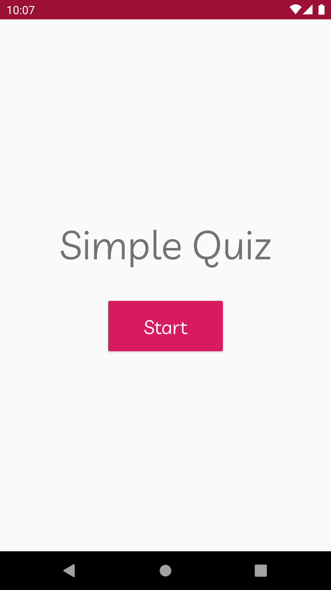
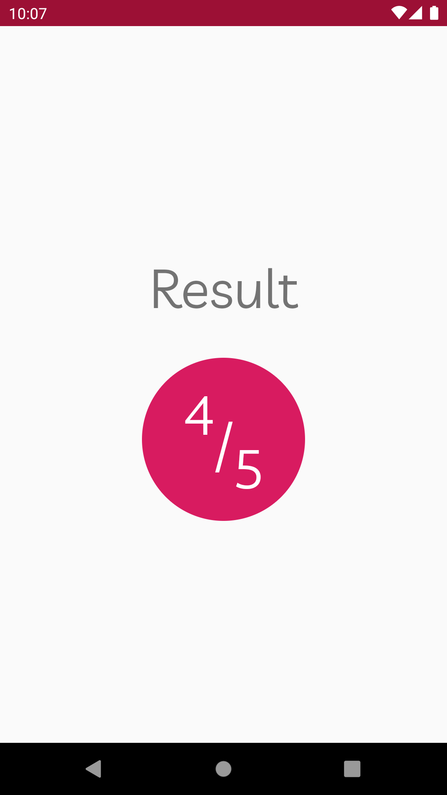

# Simple Quiz App

This is the repository of the simple multiple choices quiz app built as an example during a lecture about "Building Interactive Apps" for [One Million Arab Coders Initiative](https://www.udacity.com/mena/one-million-arab-coders/en) - Android Track.

# Screenshots
  

# Contributing
All contributions are welcome and gratefully accepted.

# License

A copy of the license is also available in the [license file](LICENSE).
